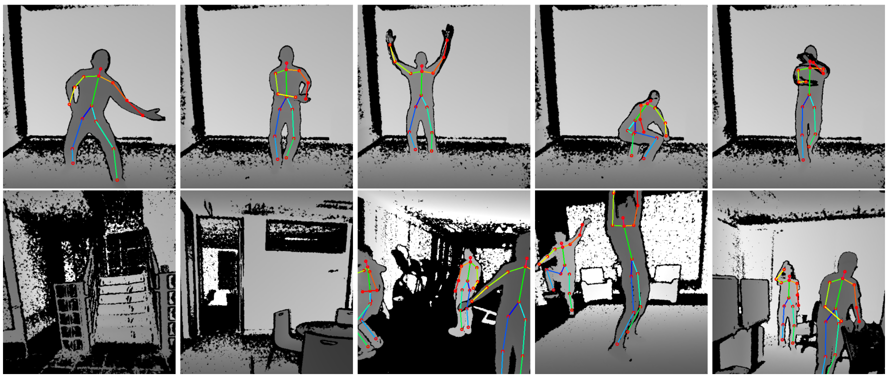
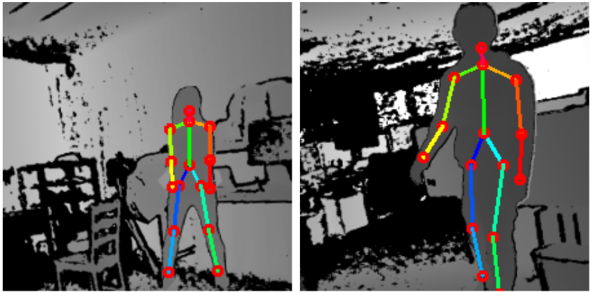
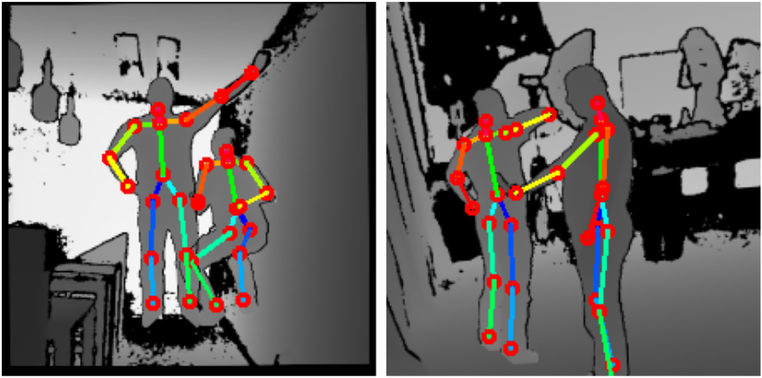
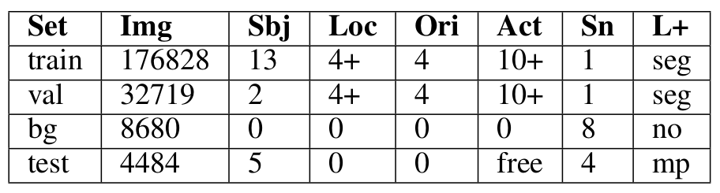
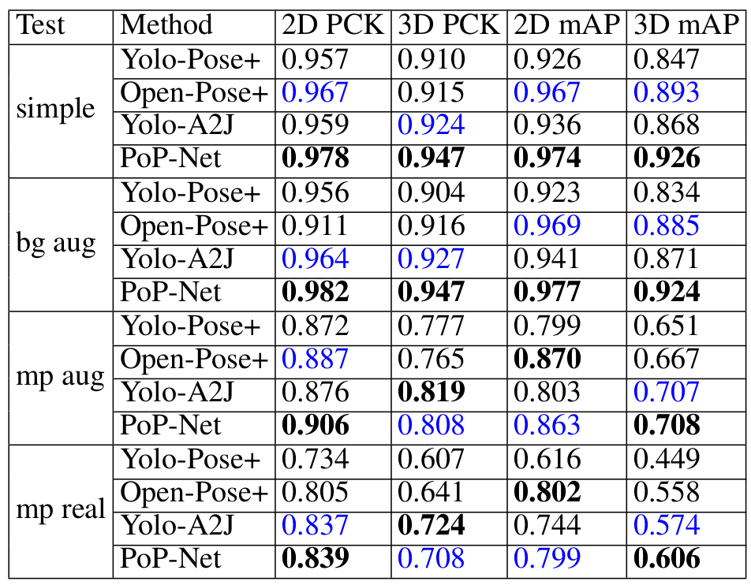
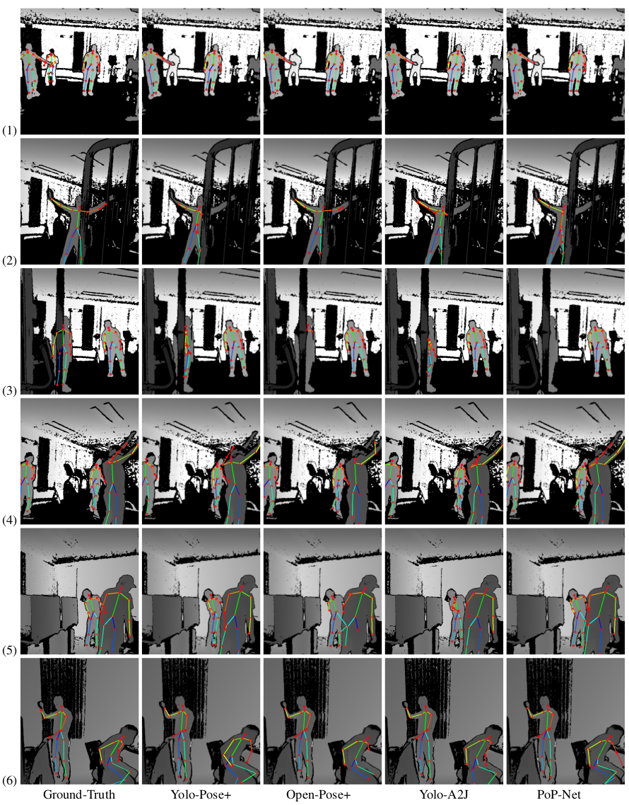

# MP-3DHP: Multi-Person 3D Human Pose Dataset

## Introduction

Multi-Person 3D HumanPose Dataset (MP-3DHP) was constructed to facilitate the development of multi-person 3D pose estimation methods
targeting real-world challenges. Specifically, it was constructed to ensure data sufficiency and diversity 
in the training data considering the variance in human poses, object scales, camera angles, truncation scenarios, background scenes, and dynamic occlusions. For the 
details in dataset construction, data augmentation methods, and the evaluation metrics, please refer to our paper:

"Pop-net: pose over parts network for multi-person 3D pose estimation from a depth image", Y. Guo, etal., arxiv, 2020 [[paper](https://arxiv.org/abs/2012.06734)]


<p align="center">
  
  <br>
    <em> Figure 1: MP-3DHP dataset. (Top)  Five  single-human  examples  recorded  from  different  locations  from  the  training  set.   (Bottom)  Two background scenes, and three multi-person testing examples are shown. </em>
</p>

In the training set, a human subject is recorded at four different locations relative to the camera plus a set of 
free-style movements. Besides labels of human joints, foreground human masks are also 
provided in the training set. Such setup enables background and multi-person augmentation methods. Two examples of 
background augmentation and two examples of multi-person augmentation are visualized in the following figure.

<p align="center">
  
  
   <br>
    <em> Figure 2: Augmented training samples. (Left) Single-person training samples augmented with a random background scene. (Right) Augmented multi-person training sample composed from multiple single-person training samples and a random background scene.</em>
</p>

The summary of the dataset is shown in the Table below.

<p align="center">
  
  <br>
    <em> Table 1: MP-3DHP Summary. The total number of images (Img), human subjects (Sbj), recording locations (Loc)}, self-orientations (Ori), action types (Act), scenes (Sn) are summarized. Additional label type (L+) indicates whether a set has segmentation (seg) or multi-person (mp) labels. </em>
</p>


## Data download and preparation

Three data folders with the following directory structure are provided to demonstrate the usage of this dataset. You 
are welcome to use the torrent file(**"./dataset.torrent"**) to download the dataset(~800GB). 
We recommended you use [bittorent](https://www.bittorrent.com/) as the download client.
These three folders by default are placed in current directory together with 'util' folder.
```
    dataset
    ├── train_val
    │   ├── depth_maps
    │   ├── seg_maps
    │   └── bg_maps
    │── test_bgaug
    │   └── depth_maps
    │── test_mpaug
    │   └── depth_maps
    └── test_mpreal
        └── depth_maps

```

The 'dataset' folder contains all the actual data files.


```
    labels
    ├── train_val
    │   ├── labels_bg.json
    │   ├── labels_train.json, labels_train_cl.json, labels_train_cr.json, labels_train_fl.json, labels_train_fr.json, labels_train_free.json
    │   └── labels_test.json, labels_test_cl.json, labels_test_cr.json, labels_test_fl.json, labels_test_fr.json, labels_test_free.json
    │── test_bgaug
    │   └── labels.json
    │── test_mpaug
    │   └── labels.json
    └── test_mpreal
        └── labels.json
```

The 'labels' folder contains all the label files.

```
    predictions
    ├── val
    │   ├── yolo_results.json
    │   ├── openpose_results.json
    │   ├── a2j_results.json
    │   └── pop_results.json
    ├── test_bgaug
    │   ├── yolo_results.json
    │   ├── openpose_results.json
    │   ├── a2j_results.json
    │   └── pop_results.json
    ├── test_mpaug
    │   ├── yolo_results.json
    │   ├── openpose_results.json
    │   ├── a2j_results.json
    │   └── pop_results.json
    └── test_mpreal
        ├── yolo_results.json
        ├── openpose_results.json
        ├── a2j_results.json
        └── pop_results.json
  ```

The 'prediction' folder contains the prediction results for four considered methods on the four testing set.


## Evaluation

The prediction result from each considered method can be compared to the ground-truth labels by using

    main_evaluate_mp_human_3D.py
    
Specifically, our evaluation consider both best-match PCK and mAP metrics to evaluate a method from different aspects. 
The results of the considering methods on the four testing set are shown in the Table below:

<p align="center">
  
  <br>
    <em> Table 2: Evaluation on MP-3DHP dataset. Competing methods are evaluated on four different testing sets. For each test set, the best method is marked in bold black while the second best method is marked in blue. </em>
</p>


## Visualization

Each of the ground-truth set can be visualized by using

    main_visualize_gt.py
    
The raw data folder and the label file needs to be set properly in the code. In the visualization, the 2D skeletons will
be displayed on depth images. If the visualizing set belongs to the training, the segmentation mask will also be 
visualized as the red region superimposed on the depth image. We did not provide visualization for 3D skeletons.

Each of the prediction results can be visualized by using

    main_visualize_pred.py
    
The data folder and the prediciton result file needs to be set properly in the code. 

Visualization of the predicated methods against the ground-truth are visualized on a set of most challenging examples 
from the testing set.

<p align="center">
  
  <br>
    <em> Figure 3: Visual comparison of competing methods on challenging cases. </em>
</p> 
